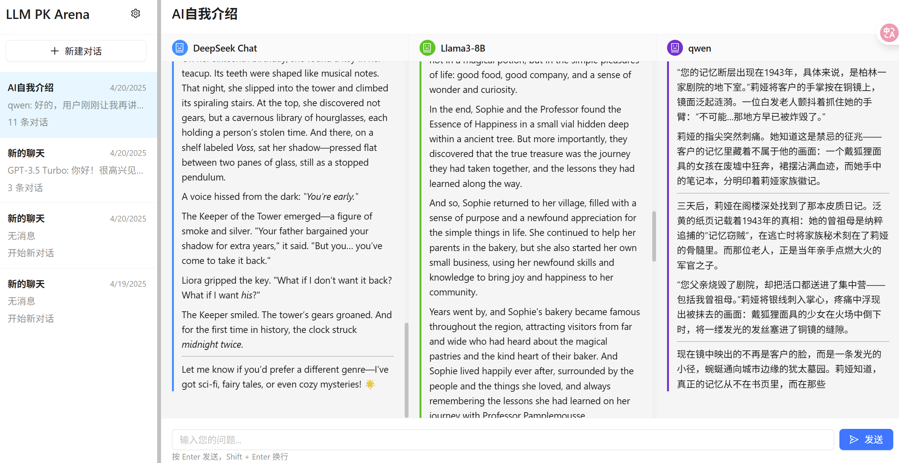

# 🤖 多模型对比聊天应用（LLM Model Comparison Chat）

一站式对比主流大语言模型（LLM）回答效果！

本项目旨在为开发者、AI爱好者和产品经理提供一个可视化、易用的多模型对比平台。你可以一次性向多个大模型（如 Llama3、Qwen、DeepSeek Chat 等）提问，实时对比它们的回答内容和响应速度，助力模型评测、Prompt 调优和产品选型。

---

## 🚀 主要功能

- **多模型并行对比**：支持同时配置和启用多个主流大模型，自动并行提问，结果一目了然。
- **响应速度展示**：每个模型的回复都带有响应时间，方便评估模型性能。
- **对话历史管理**：支持多轮对话，完整保存每轮提问和各模型回复。
- **模型灵活配置**：可通过界面增删改查模型信息，支持导入 JSON 批量配置。
- **美观易用的前端界面**：基于 React + Ant Design，三栏布局，支持暗色模式。
- **安全性设计**：敏感信息如 API Key 通过 .env 管理，避免泄露。

---

## 🖼️ 界面预览



---

## 🛠️ 快速开始

1. **安装依赖**
   ```bash
   npm install
   cd server && npm install
   ```
2. **配置模型**
   - 编辑 `server/data/modelConfig.json`，添加你的模型 API 信息（参考 `modelConfig-sample.json`）。
   - 配置 `.env` 文件，存放密钥等敏感信息。
3. **启动前后端**
   ```bash
   # 启动后端
   cd server && npm start
   # 启动前端
   npm start
   ```
4. **访问应用**
   打开浏览器访问 [http://localhost:3000](http://localhost:3000)

---

## 🌟 应用场景
- LLM 模型横向评测、性能对比
- Prompt 工程师快速调试和优化
- AI 产品选型和效果验证
- 课堂教学、演示大模型差异

---

## 📦 代码仓库与部署
- 支持一键上传 GitHub，.gitignore 已排除敏感和依赖文件
- 推荐前端部署到 Vercel，后端可部署到 Railway、Render 或自有服务器

---

## 🤝 欢迎贡献
欢迎 issue、PR 或提出新模型接入需求！

---

> 本项目仅供学习与交流，请勿用于商业用途。
Launches the test runner in the interactive watch mode.\
See the section about [running tests](https://facebook.github.io/create-react-app/docs/running-tests) for more information.

### `npm run build`

Builds the app for production to the `build` folder.\
It correctly bundles React in production mode and optimizes the build for the best performance.

The build is minified and the filenames include the hashes.\
Your app is ready to be deployed!

See the section about [deployment](https://facebook.github.io/create-react-app/docs/deployment) for more information.

### `npm run eject`

**Note: this is a one-way operation. Once you `eject`, you can't go back!**

If you aren't satisfied with the build tool and configuration choices, you can `eject` at any time. This command will remove the single build dependency from your project.

Instead, it will copy all the configuration files and the transitive dependencies (webpack, Babel, ESLint, etc) right into your project so you have full control over them. All of the commands except `eject` will still work, but they will point to the copied scripts so you can tweak them. At this point you're on your own.

You don't have to ever use `eject`. The curated feature set is suitable for small and middle deployments, and you shouldn't feel obligated to use this feature. However we understand that this tool wouldn't be useful if you couldn't customize it when you are ready for it.

## Learn More

You can learn more in the [Create React App documentation](https://facebook.github.io/create-react-app/docs/getting-started).

To learn React, check out the [React documentation](https://reactjs.org/).

### Code Splitting

This section has moved here: [https://facebook.github.io/create-react-app/docs/code-splitting](https://facebook.github.io/create-react-app/docs/code-splitting)

### Analyzing the Bundle Size

This section has moved here: [https://facebook.github.io/create-react-app/docs/analyzing-the-bundle-size](https://facebook.github.io/create-react-app/docs/analyzing-the-bundle-size)

### Making a Progressive Web App

This section has moved here: [https://facebook.github.io/create-react-app/docs/making-a-progressive-web-app](https://facebook.github.io/create-react-app/docs/making-a-progressive-web-app)

### Advanced Configuration

This section has moved here: [https://facebook.github.io/create-react-app/docs/advanced-configuration](https://facebook.github.io/create-react-app/docs/advanced-configuration)

### Deployment

This section has moved here: [https://facebook.github.io/create-react-app/docs/deployment](https://facebook.github.io/create-react-app/docs/deployment)

### `npm run build` fails to minify

This section has moved here: [https://facebook.github.io/create-react-app/docs/troubleshooting#npm-run-build-fails-to-minify](https://facebook.github.io/create-react-app/docs/troubleshooting#npm-run-build-fails-to-minify)
