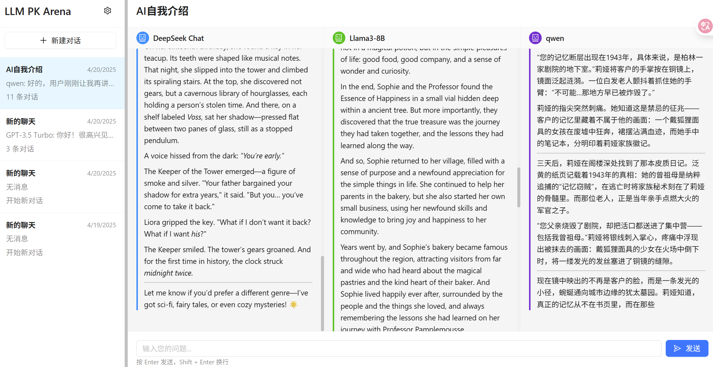

# 🤖 LLM Model Comparison Chat           ( -> [中文版](./README-cn.md) )


A one-stop platform for visually comparing the answers and response speed of mainstream Large Language Models (LLMs)!

This project is designed for developers, AI enthusiasts, and product managers who want to evaluate, debug, and select LLMs efficiently. You can ask multiple models (such as Llama3, Qwen, DeepSeek Chat, etc.) the same question in parallel and instantly compare their answers and response times.

---

## 🚀 Key Features

- **Parallel Multi-Model Comparison:** Configure and activate multiple LLMs, send questions to all at once, and see results side by side.
- **Response Time Display:** Each model's answer includes its response time for easy performance evaluation.
- **Conversation History:** Multi-turn conversation support, preserving each question and all model responses.
- **Flexible Model Management:** Add, edit, delete, or import model configurations via the UI (supports JSON batch import).
- **Modern & User-Friendly UI:** Built with React + Ant Design, featuring a clean three-column layout and dark mode support.
- **Security-Oriented:** Sensitive info such as API keys is managed via `.env` and never committed.

---

## 🖼️ Screenshot



---

## 🛠️ Getting Started

1. **Install dependencies**
   ```bash
   npm install
   cd server && npm install
   ```
2. **Configure Models**
   - Edit `server/data/modelConfig.json` to add your model API info (see `modelConfig-sample.json` for reference).
   - Add sensitive info to `.env`.
3. **Start Frontend & Backend**
   ```bash
   # Start backend
   cd server && npm start
   # Start frontend
   npm start
   ```
4. **Open in Browser**
   Visit [http://localhost:3000](http://localhost:3000)

---

## 🌟 Use Cases
- LLM benchmarking and performance comparison
- Prompt engineering and rapid debugging
- AI product evaluation and selection
- Classroom demos and LLM education

---

## 📦 Repository & Deployment
- Ready for GitHub, with sensitive and dependency files excluded via `.gitignore`
- Recommended: deploy frontend on Vercel, backend on Railway/Render/your server

---

## 🤝 Contributing
Pull requests, issues, and new model integration suggestions are welcome!

---

> For learning and research only. Not for commercial use.

---

## 🖼️ 界面预览


---

## 🛠️ 快速开始

1. **安装依赖**
   ```bash
   npm install
   cd server && npm install
   ```
2. **配置模型**
   - 编辑 `server/data/modelConfig.json`，添加你的模型 API 信息（参考 `modelConfig-sample.json`）。
   - 配置 `.env` 文件，存放密钥等敏感信息。
3. **启动前后端**
   ```bash
   # 启动后端
   cd server && npm start
   # 启动前端
   npm start
   ```
4. **访问应用**
   打开浏览器访问 [http://localhost:3000](http://localhost:3000)

---

## 🌟 应用场景
- LLM 模型横向评测、性能对比
- Prompt 工程师快速调试和优化
- AI 产品选型和效果验证
- 课堂教学、演示大模型差异

---

## 📦 代码仓库与部署
- 支持一键上传 GitHub，.gitignore 已排除敏感和依赖文件
- 推荐前端部署到 Vercel，后端可部署到 Railway、Render 或自有服务器

---

## 🤝 欢迎贡献
欢迎 issue、PR 或提出新模型接入需求！

---

> 本项目仅供学习与交流，请勿用于商业用途。
Launches the test runner in the interactive watch mode.\
See the section about [running tests](https://facebook.github.io/create-react-app/docs/running-tests) for more information.

### `npm run build`

Builds the app for production to the `build` folder.\
It correctly bundles React in production mode and optimizes the build for the best performance.

The build is minified and the filenames include the hashes.\
Your app is ready to be deployed!

See the section about [deployment](https://facebook.github.io/create-react-app/docs/deployment) for more information.

### `npm run eject`

**Note: this is a one-way operation. Once you `eject`, you can't go back!**

If you aren't satisfied with the build tool and configuration choices, you can `eject` at any time. This command will remove the single build dependency from your project.

Instead, it will copy all the configuration files and the transitive dependencies (webpack, Babel, ESLint, etc) right into your project so you have full control over them. All of the commands except `eject` will still work, but they will point to the copied scripts so you can tweak them. At this point you're on your own.

You don't have to ever use `eject`. The curated feature set is suitable for small and middle deployments, and you shouldn't feel obligated to use this feature. However we understand that this tool wouldn't be useful if you couldn't customize it when you are ready for it.

## Learn More

You can learn more in the [Create React App documentation](https://facebook.github.io/create-react-app/docs/getting-started).

To learn React, check out the [React documentation](https://reactjs.org/).

### Code Splitting

This section has moved here: [https://facebook.github.io/create-react-app/docs/code-splitting](https://facebook.github.io/create-react-app/docs/code-splitting)

### Analyzing the Bundle Size

This section has moved here: [https://facebook.github.io/create-react-app/docs/analyzing-the-bundle-size](https://facebook.github.io/create-react-app/docs/analyzing-the-bundle-size)

### Making a Progressive Web App

This section has moved here: [https://facebook.github.io/create-react-app/docs/making-a-progressive-web-app](https://facebook.github.io/create-react-app/docs/making-a-progressive-web-app)

### Advanced Configuration

This section has moved here: [https://facebook.github.io/create-react-app/docs/advanced-configuration](https://facebook.github.io/create-react-app/docs/advanced-configuration)

### Deployment

This section has moved here: [https://facebook.github.io/create-react-app/docs/deployment](https://facebook.github.io/create-react-app/docs/deployment)

### `npm run build` fails to minify

This section has moved here: [https://facebook.github.io/create-react-app/docs/troubleshooting#npm-run-build-fails-to-minify](https://facebook.github.io/create-react-app/docs/troubleshooting#npm-run-build-fails-to-minify)
